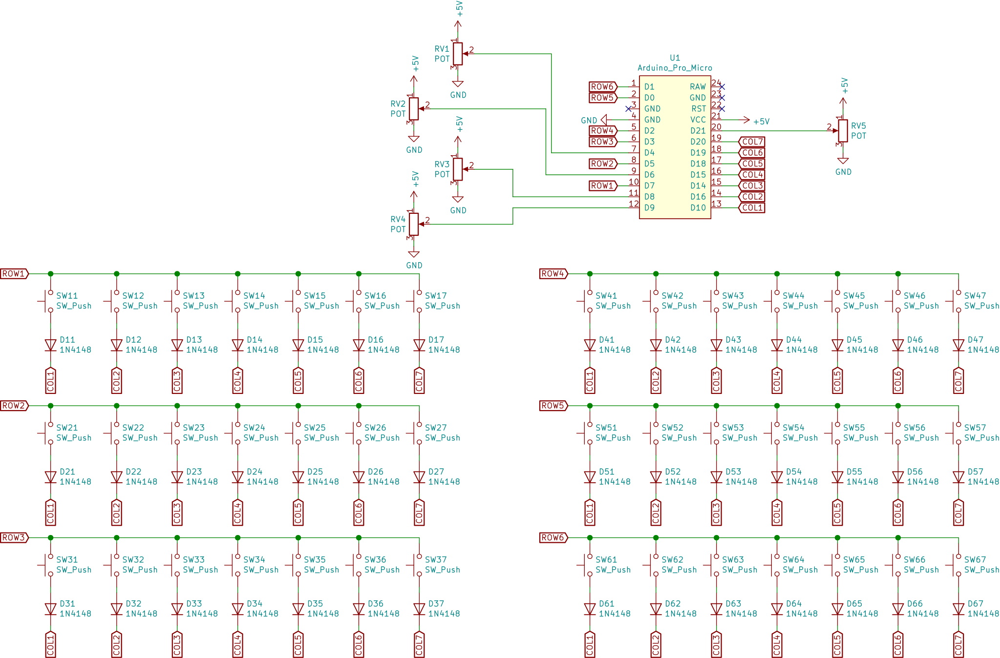
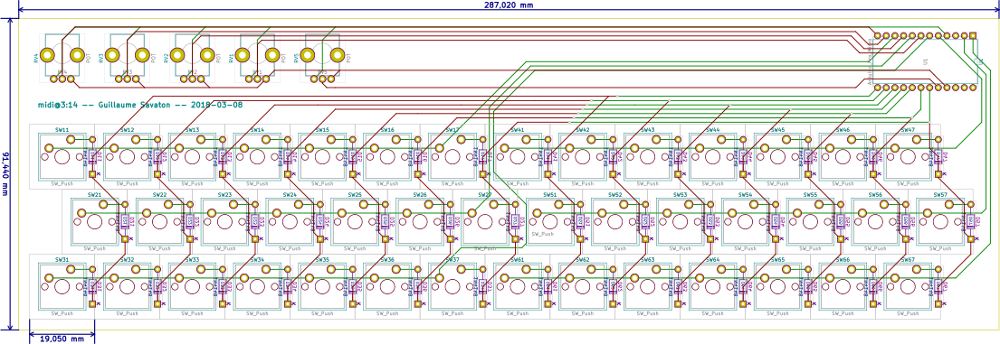
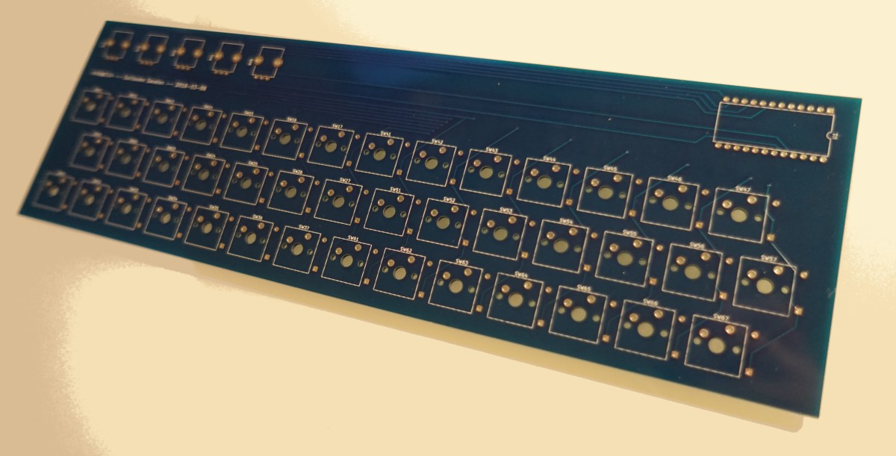

midi@3:14 is a home-made electronic keyboard for playing music.

It has been designed with the following requirements:

* Small size, light weight.
* Uniform layout.
* Compatible with any computer hardware (PC, Raspberry Pi, &hellip;) and free software synthesizers.

As a result, midi@3:14 has the following characteristics:

* [Jankó](https://en.wikipedia.org/wiki/Jank%C3%B3_keyboard) layout with 3 rows of 14 keys.
* 5 potentiometers that can be used to change the volume, or any other control value supported by the MIDI standard.
* A USB-MIDI interface.

This repository contains the CAD files of the midi@3:14 keyboard PCB.
They have been initially created with Kicad 5, and migrated to Kicad 6.

Electronic design
=================

The keyboard is designed as a switch matrix using the same techniques as a typical mechanical computer keyboard.
The main components are:

* 42 switches from the Cherry MX family,
* 42 diodes to prevent the "ghosting" effect when playing chords,
* 5 potentiometers,
* A microcontroller module, the Arduino-compatible [SparkFun Pro Micro](https://www.sparkfun.com/products/12640),
* A custom printed circuit board (PCB).

For more explanations about making a matrix keyboard, see the blog post
[How to make a keyboard - The matrix](http://blog.komar.be/how-to-make-a-keyboard-the-matrix/)
by Michał Trybus.

In this project, while the actual keyboard is composed of 3 rows with 14 keys per row,
it is electrically organized as a 6&times;7 switch matrix:

PCB layout
==========

The PCB measures about 28.7 cm by 9.1 cm.
It uses two copper layers.
The switches, potentiometers, and the *Pro Micro* module are placed on the top layer; the diodes are placed on the bottom layer.

The following footprints are used:

* Potentiometers: Bourns PTV09A, vertical.
* Switches: Cherry MX 1u, PCB-mounted.
* Diodes: DO-35, horizontal, through-hole, 10.16 mm.
* Pro Micro: DIP-24, width 15.24 mm.

Here is a picture of the PCB, manufactured by a Chinese company called [Elecrow](https://www.elecrow.com).

Bill of materials and cost
==========================

Here is the list of parts used in this project, and the additional costs.
I have kept the prices in the currencies that were used when ordering (US dollars and Euros).
Note that these prices were applicable in March 2018.
They are likely to have changed since.

The first line shows that 50 key switches were ordered from WASD while only 42 were needed.
In fact, their unit price was lower when ordering 50 and it turned out to be cheaper.

| Description                                                                                                                 | Reference         | Provider                                                       | Qty | Unit price | Total price |
|:----------------------------------------------------------------------------------------------------------------------------|:------------------|:---------------------------------------------------------------|----:|-----------:|------------:|
| [Cherry MX Red Keyswitch (Linear) PCB Mounted](https://www.wasdkeyboards.com/cherry-mx-red-keyswitch-mx1a-l1nw-linear.html) | MX1A-L1NW         | [WASD](http://www.wasdkeyboards.com)                           |  50 |      $0.75 |      $37.50 |
| [Row 4, Size 1x1 Cherry MX Keycap](https://www.wasdkeyboards.com/row-4-size-1x1-cherry-mx-keycap.html), Beige               | R4-1X1            | [WASD](http://www.wasdkeyboards.com)                           |  23 |      $1.00 |      $23.00 |
| [Row 4, Size 1x1 Cherry MX Keycap](https://www.wasdkeyboards.com/row-4-size-1x1-cherry-mx-keycap.html), Charcoal            | R4-1X1            | [WASD](http://www.wasdkeyboards.com)                           |  18 |      $1.00 |      $18.00 |
| [Row 4, Size 1x1 Cherry MX Keycap](https://www.wasdkeyboards.com/row-4-size-1x1-cherry-mx-keycap.html), Orange              | R4-1X1            | [WASD](http://www.wasdkeyboards.com)                           |   1 |      $1.00 |       $1.00 |
| Keyboard parts, shipping to France                                                                                          |                   | USPS                                                           |   1 |     $23.50 |      $23.50 |
| Printed Circuit Board                                                                                                       |                   | [Elecrow](https://www.elecrow.com)                             |   1 |     $30.47 |      $30.47 |
| Printed Circuit Board, shipping to France                                                                                   |                   | DHL                                                            |   1 |     $20.03 |      $20.03 |
| Printed Circuit Board, customs                                                                                              |                   | DHL                                                            |   1 |    23.00 € |     23.00 € |
| Potentiometer, Bourns PTV09A series, 10 kOhm                                                                                | PTV09A-4225F-B103 | [Farnell](http://fr.farnell.com/)                              |   5 |     0.97 € |      4.85 € |
| Diodes                                                                                                                      | 1N4148            | [Farnell](http://fr.farnell.com/)                              |  50 |    0.682 € |      3.41 € |
| Components, shipping                                                                                                        |                   |                                                                |   1 |     6.90 € |      6.90 € |
| Components, VAT                                                                                                             |                   |                                                                |   1 |     3.44 € |      3.44 € |
| Leonardo Pro Micro ATmega32U4                                                                                               |                   | [Chip and love](https://www.chipandlove.ch)                    |   1 |    13.00 € |     13.00 € |
| Noise dampeners for Cherry MX switches                                                                                      |                   | [IT-Services irro](https://www.itservices-irro.de/) via Amazon | 120 |            |      7.99 € |
| Potentiometer knobs                                                                                                         |                   | [Electronic Loisirs](https://electronicloisirs.com/)           |   5 |          ? |           ? |

Known issues
============

* The PCB has no mounting holes. They must be drilled manually.
* Potentiometers have been rotated by 180 degrees from their standard orientation.
  Bourns PTV09A potentiometers have a D-shaped shaft: you can use blank knobs, or knobs with a round hole and a set-screw.
* The spacing between potentiometers is too short.
  The knob diameter must be less than 19 mm.
